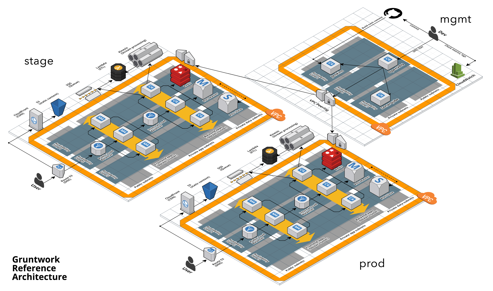
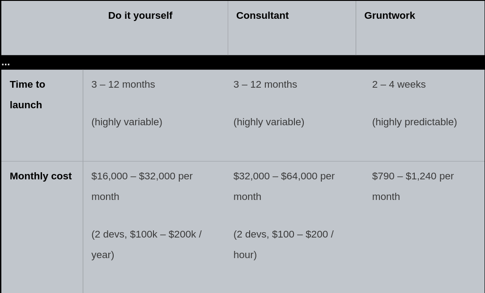

# Terraform infrastructure for nestjs-realworld-example-app

This infrastructure is build using Terraform, Heroku and the Gruntworks tool Terragrunt to help with DRYness and code
structure. 

For the limited time of the task the work is based on the combination of the following three example repos and terratest.

https://github.com/gruntwork-io/terragrunt-infrastructure-live-example
https://github.com/gruntwork-io/terragrunt-infrastructure-modules-example
https://github.com/heroku-examples/terraform-heroku-pipeline-slugs.git
https://github.com/gruntwork-io/terratest

It's aim is to show best practice and of terraform use and how a CI/CD pipeline would be built and structured on Heroku.
There was insufficient time to get it functioning and tested.

## What

Folder structure:

```bash
.
├── ...
├── heroku (cloud provider)
    ├── live (terragrunt HCL configs for modules)
        ├── eu (region)
            ├── dev (environment)
            ├── stage (environment)
            ├── prod (environment)    
    ├── modules (terraform reuseable modules)
        ├── pipeline (reuable terraform module)
    ├── tests (https://github.com/gruntwork-io/terratest automated tests for your infrastructure code )

└── ...

```

The terraform code layout is based on the best practices from the book [Terraform Up & Running](https://www.oreilly.com/library/view/terraform-up/9781492046899/)

The combination of the information conveyed about the live infrastructure and the modularization is the best way to structure
complex terraform code. 

Normally the repos in this infrastructure folder would live by themselves and be included into a fullstack repo via git 
subtrees or modules. A standard fullstack repo structure that supports the abillity to checkout one code repo and run
one command to get up and running with fullstack development is shown below. By fullstack we mean the devops and SRE 
approach of development including infratructure, frontend, backend and database.

Fullstack repo structure:

```bash

├── fullstack (parent repo)
    ├── backend (git subtree/submodule)
    ├── frontend (git subtree/submodule)
    ├── infrastucture-live (git subtree/submodule)
    ├── infrastucture-modules (git subtree/submodule)
    ├── e2e (git subtree/submodule)
    ├── dev-vm (git subtree/submodule)
    ├── Makefile
    ├── README.md
└──

```

## Why

Heroku was chosen because for the stated requirement of deploying with CI/CD to a cloud provider it's rapid, provides
Ci/CD out of the box and supports terraform via a plugin. It's a great cost effective place to start unless Heroku until 
it does not meet the requirements.

We can say that the two ends of the spectrum in terms of cloud providers could be represented by Heroku at one end and
a Kubernetes cluster at the other. The trade off between Heroku and a Kubernetes cluster to speed and simplicity vs 
cost for functionality and flexibility. Cost, Time and Flexibility are the factors we are trading off. Generally it's 
better to start simple unless there are requirements not supported. The cost in time and hence price of a more flexible
solution is often underestimated. Uncertainty risk is best mitigated by favouring convention and a ready to use solution
as opposed to writing code from scratch.     

If we were to build custom infrastructure on a cloud provider like AWS and run a kubernetes cluster it would be relevant
to consider cost of writing custom terraform code vs the gruntworks reference architecture for example.

Every project and application I have worked on in the last twenty years can be supported by the following reference
architecture.



This is a rough comparison of the three different approaches to building this with terraform on AWS from 
[https://gruntwork.io/faq/](https://gruntwork.io/faq/) that is representative of real world experience. 


